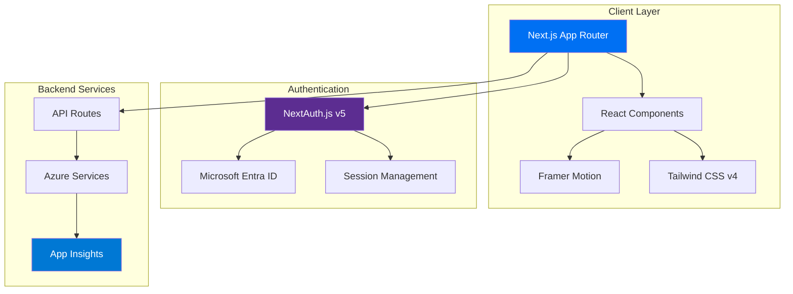
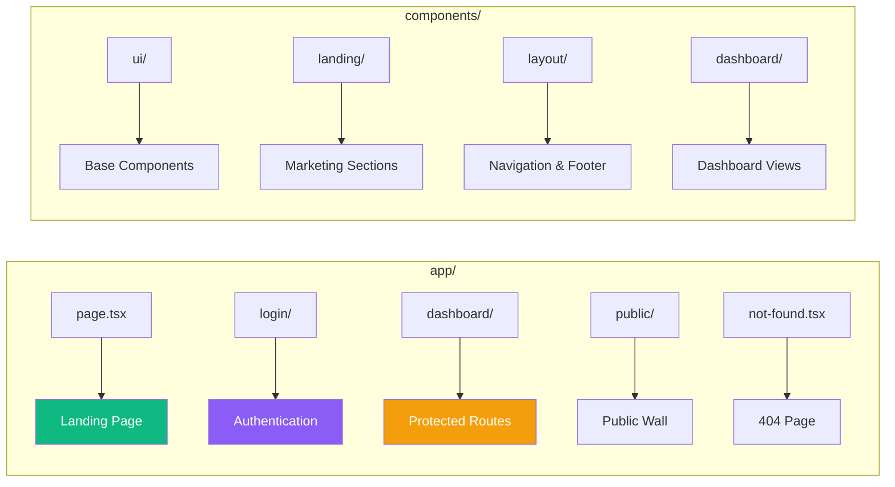
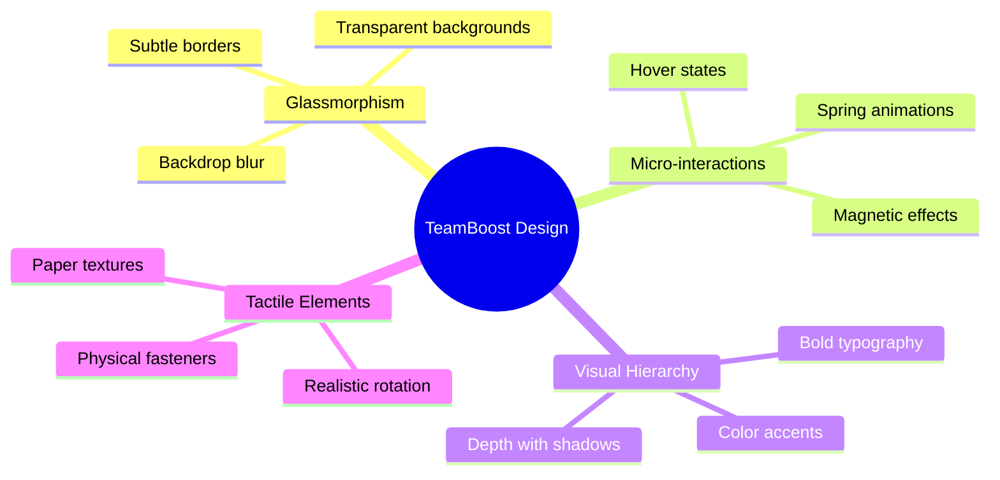
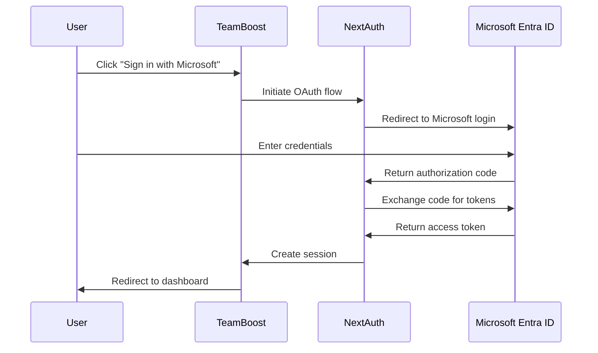
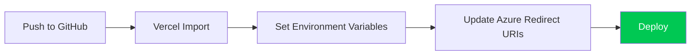

<](https://nextjs.org/)
[](https://tailwindcss.com/)
[](https://www.typescriptlang.org/)
[](https://www.framer.com/motion/)

[Features](#-features) • [Tech Stack](#-technology-stack) • [Getting Started](#-getting-started) • [Documentation](#-documentation)

</div>

---

## ✨ Features

- **🎯 Tactile Note System** — A digital corkboard with realistic sticky notes featuring paper textures, randomized rotation, and physical fasteners
- **🔐 Enterprise SSO** — Secure authentication via Microsoft Entra ID (Azure AD)
- **📊 Real-time Telemetry** — Performance monitoring with Azure Application Insights
- **🌙 Dark/Light Mode** — Full theme support with smooth transitions
- **🎨 Premium UI** — Glassmorphism, micro-animations, and modern design patterns
- **📱 Fully Responsive** — Optimized for all screen sizes

---

## � Technology Stack

| Category | Technology |
|----------|------------|
| **Framework** | [Next.js 16](https://nextjs.org/) (App Router) |
| **Styling** | [Tailwind CSS v4](https://tailwindcss.com/) |
| **UI Components** | [Shadcn/UI](https://ui.shadcn.com/) (Radix Primitives) |
| **Animations** | [Framer Motion](https://www.framer.com/motion/) |
| **Smooth Scrolling** | [Lenis](https://lenis.studiofreight.com/) |
| **Authentication** | [NextAuth.js v5](https://authjs.dev/) (Microsoft Entra ID) |
| **Telemetry** | [Azure Application Insights](https://learn.microsoft.com/en-us/azure/azure-monitor/app/app-insights-overview) |
| **Icons** | [Lucide React](https://lucide.dev/) |
| **Fonts** | Inter (Sans), Patrick Hand (Handwriting) |

---

## � Architecture Overview



---

## 📁 Project Structure



### Directory Breakdown

```
team-boost/
├── app/                          # Next.js App Router
│   ├── api/                      # API routes
│   ├── dashboard/                # Protected dashboard pages
│   │   └── notes/                # Notes management
│   ├── login/                    # Authentication page
│   ├── public/                   # Public wall page
│   ├── globals.css               # Global styles & design tokens
│   ├── layout.tsx                # Root layout
│   ├── not-found.tsx             # Custom 404 page
│   └── page.tsx                  # Landing page
│
├── components/
│   ├── landing/                  # Marketing page sections
│   │   ├── HeroSection.tsx       # Hero with 3D visuals
│   │   ├── StorySection.tsx      # Feature showcase
│   │   ├── FinalCTASection.tsx   # Call-to-action
│   │   ├── PublicPreviewSection.tsx
│   │   └── Marquee.tsx           # Infinite scroll ticker
│   │
│   ├── layout/                   # Layout components
│   │   ├── floating-navbar.tsx   # Glassmorphic navigation
│   │   ├── site-footer.tsx       # Footer component
│   │   └── footer-wrapper.tsx
│   │
│   ├── ui/                       # Reusable UI components
│   │   ├── TactileNoteCard.tsx   # Sticky note component
│   │   ├── MagneticButton.tsx    # Interactive button
│   │   ├── BackgroundGrid.tsx    # Grid pattern overlay
│   │   ├── MeshBackground.tsx    # Gradient mesh
│   │   ├── border-beam.tsx       # Animated border effect
│   │   └── ...                   # Shadcn/UI components
│   │
│   └── dashboard/                # Dashboard-specific components
│
├── lib/                          # Utilities & helpers
│   └── mock-data.ts              # Development mock data
│
├── hooks/                        # Custom React hooks
└── public/                       # Static assets
```

---

## 🎨 Design System

### Tactile Design Philosophy



### Color Palette

| Token | Light Mode | Dark Mode | Usage |
|-------|------------|-----------|-------|
| `--background` | White | `#0a0a0a` | Page background |
| `--foreground` | Dark | Light | Primary text |
| `--neon-blue` | — | `oklch(0.7 0.25 260)` | Accent highlights |
| `--neon-purple` | — | `oklch(0.65 0.3 310)` | Primary accent |
| Selection | Purple | Purple | Text selection |

### Key UI Components

| Component | Description |
|-----------|-------------|
| `TactileNoteCard` | Realistic sticky note with paper texture, rotation, and fasteners |
| `MagneticButton` | Button with cursor-following magnetic effect |
| `FloatingNavbar` | Glassmorphic navigation with morphing mobile menu |
| `BorderBeam` | Animated gradient border effect |
| `BackgroundGrid` | Subtle grid pattern overlay |

---

## � Getting Started

### Prerequisites

- **Node.js 18+** installed
- **Azure Cloud Account** (for Auth & Telemetry)

### 1. Clone & Install

```bash
git clone https://github.com/thezaynahmed/team-boost.git
cd team-boost
npm install
```

### 2. Environment Configuration

Create a `.env.local` file in the root directory:

```bash
# Authentication (NextAuth.js)
AUTH_SECRET="<Generated Secret>"  # Run: openssl rand -base64 32

# Microsoft Entra ID (Azure AD)
AUTH_MICROSOFT_ENTRA_ID_ID=""
AUTH_MICROSOFT_ENTRA_ID_SECRET=""
AUTH_MICROSOFT_ENTRA_ID_TENANT_ID=""

# Telemetry (Azure Application Insights)
NEXT_PUBLIC_APPINSIGHTS_CONNECTION_STRING=""
```

### 3. Run Development Server

```bash
npm run dev
```

Open [http://localhost:3000](http://localhost:3000) to view the app.

---

## 🔐 Authentication Setup

### Microsoft Entra ID Configuration



### Setup Steps

1. **Register Application** in [Azure Portal](https://portal.azure.com/)
   - Navigate to **Microsoft Entra ID** → **App registrations** → **+ New registration**
   - Name: `TeamBoost-Dev`
   - Redirect URI: `http://localhost:3000/api/auth/callback/microsoft-entra-id`

2. **Configure Credentials**
   - Copy **Application (client) ID** → `AUTH_MICROSOFT_ENTRA_ID_ID`
   - Copy **Directory (tenant) ID** → `AUTH_MICROSOFT_ENTRA_ID_TENANT_ID`
   - Create **Client Secret** → `AUTH_MICROSOFT_ENTRA_ID_SECRET`

---

## 📊 Telemetry Setup

### Azure Application Insights

1. **Create Resource** in Azure Portal
   - Search for **"Application Insights"** → **+ Create**
   - Resource Group: `rg-teamboost-dev`
   - Name: `ai-teamboost-dev`

2. **Get Connection String**
   - Navigate to resource **Overview** page
   - Copy **Connection String** → `NEXT_PUBLIC_APPINSIGHTS_CONNECTION_STRING`

---

## 🚢 Deployment

### Vercel (Recommended)



1. Push code to GitHub
2. Import project into [Vercel](https://vercel.com)
3. Add environment variables in project settings
4. Update Azure App Registration redirect URI:
   ```
   https://<your-domain>.vercel.app/api/auth/callback/microsoft-entra-id
   ```

### Azure Container Apps / App Service

1. Build Docker image or configure Node.js runtime
2. Inject environment variables
3. Update redirect URIs in Azure App Registration

---

## 📜 Available Scripts

| Command | Description |
|---------|-------------|
| `npm run dev` | Start development server |
| `npm run build` | Build for production |
| `npm run start` | Start production server |
| `npm run lint` | Run ESLint |

---

## 🧑‍💻 Developer Notes

### Adding Mock Data

Edit `lib/mock-data.ts` to add test notes and users.

### Extending the UI

- **Global Styles**: `app/globals.css` (design tokens, animations)
- **Theme**: Managed via `next-themes` (Dark/Light modes)
- **Icons**: Use `lucide-react` for iconography
- **Animations**: Use `framer-motion` for complex animations

### Custom Text Selection

The app uses a custom purple text selection style matching the brand colors:

```css
::selection {
  background: oklch(0.55 0.25 290);
  color: #ffffff;
}
```

---

## 📄 License

This project is private and proprietary.

---

<div align="center">

**Built with ❤️ by [Zain Ahmed](https://github.com/thezaynahmed)**

</div>
]]>
