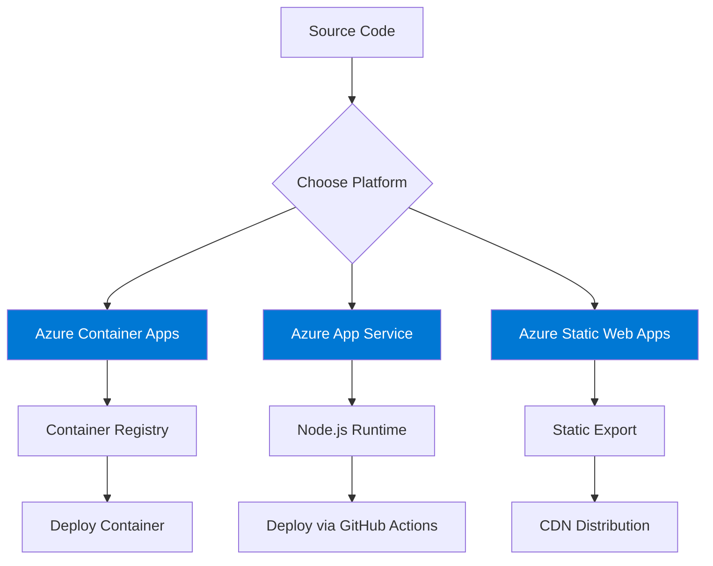

<div align="center">

# TeamBoost

**A modern, collaborative team management platform designed to enhance productivity and team spirit.**

[](https://nextjs.org/)
[](https://tailwindcss.com/)
[](https://www.typescriptlang.org/)
[](https://www.framer.com/motion/)

[Features](#features) • [Tech Stack](#technology-stack) • [Getting Started](#getting-started) • [Deployment](#deployment)

</div>

---

## Features

- **Tactile Note System** — A digital corkboard with realistic sticky notes featuring paper textures, randomized rotation, and physical fasteners
- **Enterprise SSO** — Secure authentication via Microsoft Entra ID (Azure AD)
- **Real-time Telemetry** — Performance monitoring with Azure Application Insights
- **Dark/Light Mode** — Full theme support with smooth transitions
- **Premium UI** — Glassmorphism, micro-animations, and modern design patterns
- **Fully Responsive** — Optimized for all screen sizes

---

## Technology Stack

| Category | Technology |
|----------|------------|
| **Framework** | [Next.js 16](https://nextjs.org/) (App Router) |
| **Styling** | [Tailwind CSS v4](https://tailwindcss.com/) |
| **UI Components** | [Shadcn/UI](https://ui.shadcn.com/) (Radix Primitives) |
| **Animations** | [Framer Motion](https://www.framer.com/motion/) |
| **Smooth Scrolling** | [Lenis](https://lenis.studiofreight.com/) |
| **Authentication** | [NextAuth.js v5](https://authjs.dev/) (Microsoft Entra ID) |
| **Telemetry** | [Azure Application Insights](https://learn.microsoft.com/en-us/azure/azure-monitor/app/app-insights-overview) |
| **Icons** | [Lucide React](https://lucide.dev/) |
| **Fonts** | Inter (Sans), Patrick Hand (Handwriting) |

---

## Architecture Overview


---

## Database Architecture

<p align="center">
  
</p>

---

## Project Structure


### Directory Breakdown

```
team-boost/
├── app/                              # Next.js App Router
│   ├── api/
│   │   └── auth/                     # NextAuth.js API routes
│   │       └── [...nextauth]/        # Auth handlers
│   ├── dashboard/                    # Protected dashboard pages
│   │   ├── notes/                    # Notes management
│   │   ├── settings/                 # User settings
│   │   ├── team/                     # Team management
│   │   ├── layout.tsx                # Dashboard layout with sidebar
│   │   └── page.tsx                  # Dashboard home
│   ├── login/                        # Authentication page
│   │   └── page.tsx                  # Microsoft SSO login
│   ├── pricing/                      # Pricing page
│   │   └── page.tsx
│   ├── public/                       # Public wall page
│   │   └── page.tsx
│   ├── globals.css                   # Global styles & design tokens
│   ├── layout.tsx                    # Root layout
│   ├── not-found.tsx                 # Custom 404 page
│   └── page.tsx                      # Landing page
│
├── components/
│   ├── dashboard/                    # Dashboard-specific components
│   │   ├── note-card.tsx             # Dashboard note card
│   │   ├── recent-activity.tsx       # Activity feed
│   │   └── stats-cards.tsx           # Statistics overview
│   │
│   ├── landing/                      # Marketing page sections
│   │   ├── FinalCTASection.tsx       # Call-to-action section
│   │   ├── HeroSection.tsx           # Hero with 3D visuals
│   │   ├── Marquee.tsx               # Infinite scroll ticker
│   │   ├── PublicPreviewSection.tsx  # Public wall preview
│   │   └── StorySection.tsx          # Feature showcase
│   │
│   ├── layout/                       # Layout components
│   │   ├── floating-navbar.tsx       # Glassmorphic navigation
│   │   ├── footer-wrapper.tsx        # Footer context wrapper
│   │   └── site-footer.tsx           # Main footer component
│   │
│   ├── marketing/                    # Marketing components
│   │   ├── site-footer.tsx           # Marketing footer
│   │   └── site-header.tsx           # Marketing header
│   │
│   ├── notes/                        # Note-related components
│   │
│   ├── public/                       # Public-facing components
│   │
│   ├── sections/                     # Reusable page sections
│   │
│   ├── ui/                           # Reusable UI components
│   │   ├── BackgroundGrid.tsx        # Grid pattern overlay
│   │   ├── HeroVisual.tsx            # 3D hero visual
│   │   ├── MagneticButton.tsx        # Interactive button
│   │   ├── MeshBackground.tsx        # Gradient mesh
│   │   ├── SmoothScroll.tsx          # Lenis scroll wrapper
│   │   ├── TactileNoteCard.tsx       # Sticky note component
│   │   ├── border-beam.tsx           # Animated border effect
│   │   └── ...                       # Shadcn/UI components
│   │                                 # (avatar, badge, button, card,
│   │                                 #  dropdown-menu, input, separator,
│   │                                 #  sheet, sidebar, skeleton, table,
│   │                                 #  tooltip, breadcrumb)
│   │
│   ├── app-insights.tsx              # Azure App Insights wrapper
│   ├── app-sidebar.tsx               # Dashboard sidebar
│   ├── mode-toggle.tsx               # Dark/Light mode toggle
│   ├── nav-main.tsx                  # Main navigation
│   ├── nav-projects.tsx              # Projects navigation
│   ├── nav-user.tsx                  # User menu navigation
│   ├── team-switcher.tsx             # Team switcher component
│   └── theme-provider.tsx            # Theme context provider
│
├── lib/                              # Utilities & helpers
│   ├── auth.ts                       # NextAuth.js configuration
│   ├── mock-data.ts                  # Development mock data
│   └── utils.ts                      # Utility functions (cn, etc.)
│
├── hooks/                            # Custom React hooks
│   └── use-mobile.ts                 # Mobile detection hook
│
├── infrastructure/                   # Azure deployment resources
│   ├── bicep/                        # Azure Bicep templates
│   ├── scripts/                      # Deployment scripts
│   └── README.md                     # Infrastructure documentation
│
├── diagrams/                         # Architecture diagrams
│
├── public/                           # Static assets
│   ├── file.svg
│   ├── globe.svg
│   ├── next.svg
│   ├── vercel.svg
│   └── window.svg
│
├── middleware.ts                     # Next.js middleware (auth)
├── next.config.ts                    # Next.js configuration
├── tailwind.config.ts                # Tailwind CSS configuration
└── tsconfig.json                     # TypeScript configuration
```

---

## Design System

### Tactile Design Philosophy


### Color Palette

| Token | Light Mode | Dark Mode | Usage |
|-------|------------|-----------|-------|
| `--background` | White | `#0a0a0a` | Page background |
| `--foreground` | Dark | Light | Primary text |
| `--neon-blue` | — | `oklch(0.7 0.25 260)` | Accent highlights |
| `--neon-purple` | — | `oklch(0.65 0.3 310)` | Primary accent |
| Selection | Purple | Purple | Text selection |

### Key UI Components

| Component | Description |
|-----------|-------------|
| `TactileNoteCard` | Realistic sticky note with paper texture, rotation, and fasteners |
| `MagneticButton` | Button with cursor-following magnetic effect |
| `FloatingNavbar` | Glassmorphic navigation with morphing mobile menu |
| `BorderBeam` | Animated gradient border effect |
| `BackgroundGrid` | Subtle grid pattern overlay |

---

## Getting Started

### Prerequisites

- **Node.js 18+** installed
- **Azure Cloud Account** (for Auth & Telemetry)

### 1. Clone & Install

```bash
git clone https://github.com/thezaynahmed/team-boost.git
cd team-boost
npm install
```

### 2. Environment Configuration

Create a `.env.local` file in the root directory:

```bash
# Authentication (NextAuth.js)
AUTH_SECRET="<Generated Secret>"  # Run: openssl rand -base64 32

# Microsoft Entra ID (Azure AD)
AUTH_MICROSOFT_ENTRA_ID_ID=""
AUTH_MICROSOFT_ENTRA_ID_SECRET=""
AUTH_MICROSOFT_ENTRA_ID_TENANT_ID=""

# Telemetry (Azure Application Insights)
NEXT_PUBLIC_APPINSIGHTS_CONNECTION_STRING=""
```

### 3. Run Development Server

```bash
npm run dev
```

Open [http://localhost:3000](http://localhost:3000) to view the app.

---

## Authentication Setup

### Microsoft Entra ID Configuration


### Setup Steps

1. **Register Application** in [Azure Portal](https://portal.azure.com/)
   - Navigate to **Microsoft Entra ID** → **App registrations** → **+ New registration**
   - Name: `TeamBoost-Dev`
   - Redirect URI: `http://localhost:3000/api/auth/callback/microsoft-entra-id`

2. **Configure Credentials**
   - Copy **Application (client) ID** → `AUTH_MICROSOFT_ENTRA_ID_ID`
   - Copy **Directory (tenant) ID** → `AUTH_MICROSOFT_ENTRA_ID_TENANT_ID`
   - Create **Client Secret** → `AUTH_MICROSOFT_ENTRA_ID_SECRET`

---

## Telemetry Setup

### Azure Application Insights

1. **Create Resource** in Azure Portal
   - Search for **"Application Insights"** → **+ Create**
   - Resource Group: `rg-teamboost-dev`
   - Name: `ai-teamboost-dev`

2. **Get Connection String**
   - Navigate to resource **Overview** page
   - Copy **Connection String** → `NEXT_PUBLIC_APPINSIGHTS_CONNECTION_STRING`

---

## Deployment

### Azure Deployment Options



### Option 1: Azure Container Apps (Recommended)

1. **Build Docker Image**
   ```bash
   docker build -t teamboost:latest .
   ```

2. **Push to Azure Container Registry**
   ```bash
   az acr login --name <your-registry>
   docker tag teamboost:latest <your-registry>.azurecr.io/teamboost:latest
   docker push <your-registry>.azurecr.io/teamboost:latest
   ```

3. **Deploy to Container Apps**
   ```bash
   az containerapp create \
     --name teamboost \
     --resource-group rg-teamboost \
     --environment <your-environment> \
     --image <your-registry>.azurecr.io/teamboost:latest \
     --target-port 3000 \
     --ingress external
   ```

4. **Configure Environment Variables**
   - Add all `.env.local` variables in Azure Portal → Container App → Configuration

5. **Update Redirect URI**
   - Azure App Registration → Authentication → Add:
   ```
   https://<your-app>.azurecontainerapps.io/api/auth/callback/microsoft-entra-id
   ```

### Option 2: Azure App Service

1. **Create App Service**
   - Runtime: Node.js 18 LTS
   - OS: Linux

2. **Configure Deployment**
   - Enable GitHub Actions deployment or use Azure CLI:
   ```bash
   az webapp up --name teamboost-app --resource-group rg-teamboost --runtime "NODE:18-lts"
   ```

3. **Set Environment Variables**
   - Azure Portal → App Service → Configuration → Application settings

4. **Update Redirect URI** in Azure App Registration

### Option 3: Azure Static Web Apps

> **Note:** Requires `next export` for static generation. Some features may not be compatible.

1. **Create Static Web App** in Azure Portal
2. **Connect to GitHub Repository**
3. **Configure Build**:
   - App location: `/`
   - Output location: `out`
   - Build command: `npm run build`

---

## Available Scripts

| Command | Description |
|---------|-------------|
| `npm run dev` | Start development server |
| `npm run build` | Build for production |
| `npm run start` | Start production server |
| `npm run lint` | Run ESLint |

---

## Developer Notes

### Adding Mock Data

Edit `lib/mock-data.ts` to add test notes and users.

### Extending the UI

- **Global Styles**: `app/globals.css` (design tokens, animations)
- **Theme**: Managed via `next-themes` (Dark/Light modes)
- **Icons**: Use `lucide-react` for iconography
- **Animations**: Use `framer-motion` for complex animations

### Custom Text Selection

The app uses a custom purple text selection style matching the brand colors:

```css
::selection {
  background: oklch(0.55 0.25 290);
  color: #ffffff;
}
```

---

## License

This project is private and proprietary.

---

<div align="center">

**Built by [Zain Ahmed](https://github.com/thezaynahmed)**

</div>
